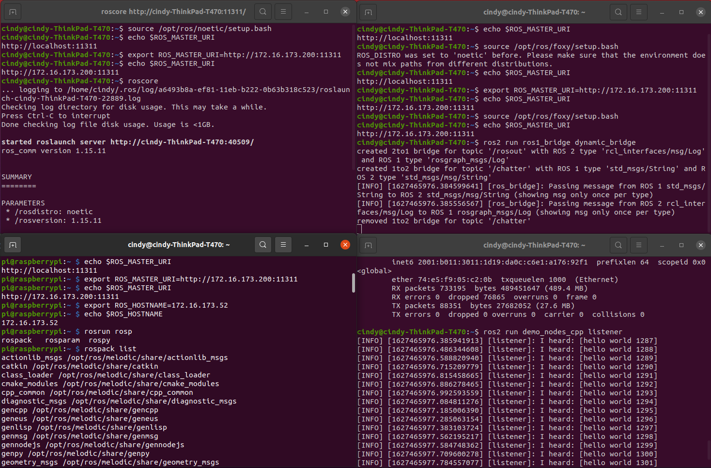

# raspbian on raspberry pi zero w
## Installing raspbian OS
### headless SSH
* editing the `wpa_supplicant.conf` as the [instruction](https://www.raspberrypi.org/documentation/configuration/wireless/wireless-cli.md)
* SSH can be enabled by placing a file named `ssh` in /boot, as [this step](https://www.raspberrypi.org/documentation/remote-access/ssh/)
## Install ROS1 for raspberry pi zero w
Following the [instruction](http://wiki.ros.org/ROSberryPi/Installing%20ROS%20Melodic%20on%20the%20Raspberry%20Pi)
### update GPG key
The old gpg key is deprecated and update using [new](https://discourse.ros.org/t/ros-gpg-key-expiration-incident/20669)
### Adding Released Packages
Install `ros_comm` and `common_msgs`(this is for lidar msg)
```sh
rosinstall_generator ros_comm common_msgs --rosdistro melodic --deps --wet-only --tar > melodic-custom_ros.rosinstall
```
Note: This instruction compile ROS1 on raspberry pi directory and it needs 4-5 hours, so a better flow is using docker for cross compiling.(for future work)
## Multiple machine running ros2 and ros1 and communicating with ros1_bridge
Remote PC(ubuntu 20.04):
* ros noetic
* ros2 foxy
* ros1_bridge
If we just use std_msgs and no custom message is compiled and we can install via debian package, otherwise, clone the repo and build from source. See [readme](https://github.com/ros2/ros1_bridge).
```sh
sudo apt install ros-foxy-ros1-bridge
```
Raspberry Pi zero w (raspbian):
* ros melodic
### publisher from raspberry pi zero w ros1 to remote PC ros2 subscriber
First we start a ROS 1 `roscore` on remote PC:
```sh
# Shell A on remote PC
source /opt/ros/noetic/setup.bash
export ROS_MASTER_URI=http://<IP of remote PC>:11311
roscore
```
Then dynamic bridge:
```sh
# Shell B on remote PC
# Source ROS 1 first:
source /opt/ros/noetic/setup.bash
export ROS_MASTER_URI=http://<IP of remote PC>:11311
# Source ROS 2 next:
source /opt/ros/foxy/setup.bash
ros2 run ros1_bridge dynamic_bridge
```
On raspberry pi zero w, run the ros1 package `roscpp_tutorials`(copy from the [repo](http://wiki.ros.org/roscpp_tutorials) and build only `talker.cpp` in `/catkin_ws/`) 
```sh
# Shell C on raspberry pi zero w through SSH
source /opt/ros/melodic/setup.bash
export ROS_MASTER_URI=http://<IP of remote PC>:11311
export ROS_HOSTNAME=<IP of raspberry pi zero w> # no http://
rosrun roscpp_tutorials talker
```
The program will start outputting. And the Shell B on remote PC shows up the talker messages. (See the upper right shell of the following figure).

Now we start the ROS 2 listener from the demo_nodes_cpp ROS 2 package.
```sh
# Shell D on remote PC
source /opt/ros/foxy/setup.bash
ros2 run demo_nodes_cpp listener
```
And from the figure above we are seeing listener catching messages. (See the lower right shell).
## Install ROS2 for raspberry pi zero w (not successful)
[ros wiki](https://answers.ros.org/question/299588/can-ros2-run-on-raspberry-pi-zero-w/) suggest 2 method for runnung ROS2 on raspberry pi zero w: 
* **on Arch Linux**: could not build ros2-foxy through pacman, because fail of building fast-rtps
* **on Raspbian(Official OS for Raspberry Pi zero w)**

Both method highly suggest cross compiling (runs really really much faster)
> Another reference for installing ROS2 directory from source on Raspbian on [raspberry pi 4b](https://medium.com/swlh/raspberry-pi-ros-2-camera-eef8f8b94304)
### Cross compining on the top of raspbian OS
#### set locale
[instruction](https://unix.stackexchange.com/questions/269159/problem-of-cant-set-locale-make-sure-lc-and-lang-are-correct)
#### install dependency on raspberry pi zero
```sh
sudo apt-get install libeigen3-dev
```
[cross compile env docker](https://github.com/cyberbotics/epuck_ros2/tree/master/installation/cross_compile): cross compiling ros2 packages but can't build `cyclonedds` package as this [issue](https://github.com/cyberbotics/epuck_ros2/issues/26), also can't build `rosidl_typesupport_connext_cpp` because `RTI Connext` is not supported now so tried somthing else. The file structure is shown in this [paper](https://lukic.io/files/E-puck2_ROS2_Webots.pdf). And another [question](https://answers.ros.org/question/382582/what-is-the-correct-way-of-installing-ros2-foxy-on-a-raspberry-pi-zero/) on ros-wiki used this cross-compile tool but not succeeded.
### Tools of Cross compiling
This [reference](https://raspberrypi.stackexchange.com/questions/103737/cross-compile-for-raspberry-pi-zero-from-ubuntu) answered cross compiler tools options for **raspberry pi zero**.
* [RaspberryPi toolchain](https://github.com/raspberrypi/tools): older gcc 4.9.3, [example](https://medium.com/@au42/the-useful-raspberrypi-cross-compile-guide-ea56054de187) of compiling WiringPi library.
* [RaspberryPi toolchains v3](https://github.com/abhiTronix/raspberry-pi-cross-compilers): newer gcc(8.3 and later) and with complete detail [steps](https://github.com/abhiTronix/raspberry-pi-cross-compilers/wiki/Cross-Compiler-CMake-Usage-Guide-with-rsynced-Raspberry-Pi-32-bit-OS#cross-compiler-cmake-usage-guide-with-rsynced-raspberry-pi-32-bit-os) for newbies and cross-compile `QT` as example. Note: Link Time Optimization [enable](https://github.com/abhiTronix/raspberry-pi-cross-compilers/wiki/Cross-Compiler:-Installation-Instructions#d-advanced-information) and [Flags](https://github.com/abhiTronix/raspberry-pi-cross-compilers#optimization-flags-involved)
* [buildroot](https://buildroot.org/): has a PIZero (as well as PiZeroW) [target](https://git.buildroot.net/buildroot/tree/configs/raspberrypi0_defconfig)
* [crosstool-NG](https://crosstool-ng.github.io/docs/introduction/): most popular (see [samples](https://github.com/crosstool-ng/crosstool-ng/tree/master/samples)) but `armv6-rpi-linux-gnueabi` is no longer exit and use `armv6-unknown-linux-gnueabi` for raspberry pi zero (and w).

The [ROS 2 Doc](https://docs.ros.org/en/foxy/Guides/Cross-compilation.html) used [cross_compile](https://github.com/ros-tooling/cross_compile) package. Which support architecture `armhf`, which means arm processors (`armv8+`) that have hardware floating point support. **raspberry pi zero w** is `armv6` but work arounds to deal with the lack of floating point support on the original raspberry pi's.([reference](https://stackoverflow.com/questions/37790029/what-is-difference-between-arm64-and-armhf)). But ROS2 Foxy is not available in Debian Buster for `armhf` as this [issue](https://github.com/ros-tooling/cross_compile/issues/328) and this [answer](https://answers.ros.org/question/358733/unable-to-build-ros-foxy-for-arm32-architecture/)